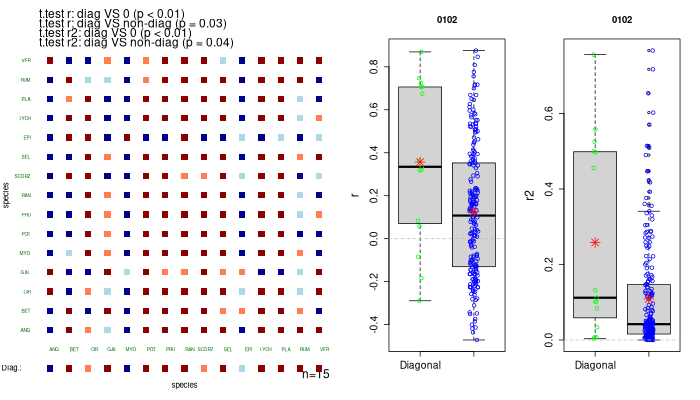
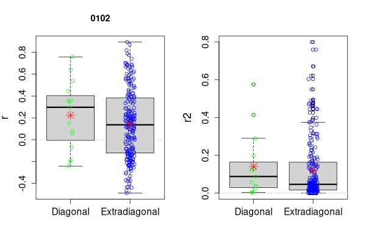

---
output:
  html_document: default
  pdf_document: default
---
# Function for computation of correlations of conspecifics vs heterospecifics

The function uses a non-symmetric correlation matrix (other measures of a relationship can be used as well) between the same set of species, once as seedlings (rows of the matrix), and once as adults (columns). The species absent in one of the groups are omitted. The diagonal then represents relationships of conspecific pairs, the extradiagonal relationships of the heterospecific pairs. Then we ask whether the relationships are stronger for the conspecifics (i.e. on the diagonal) than for heterospecifics. We tested this difference by the two-sample t-test and the script also provides a comparison of distribution of the correlations, because the size of the difference might be more interesting than mere results of the test (there are more reasons, why the conspecifics might be more tightly correlated than heterospecifics). Importantly, the relationships of heterospecific pairs might frequently be negative (most probably due to discordant response to local environmental variation or negative interactions between the two species), and less frequently negative also for the conspecifics, e.g. due to conspecific negative density dependence. So, if the measure of the relationship is the correlation coefficient (r), we might also want to test the general strength of the relationship. Thus, we recommend using r from the correlation matrix (to test whether the correlation is different for conspecific pairs than for heterospecific pairs, with expectation that conspecifics will be more positive), or the coefficient of determination r2 (to test, whether the relationship is stronger for the conspecifics, regardless of the direction of the relationship).

The individual elements in the matrix are not independent, so using an ordinary t-test would result in an inflated number of independent observations. A permutation test is the appropriate solution for generating the null distribution of the t-criterion under the null hypothesis. We permuted species order in one of the groups (permutation of the matrix columns breaks the linkage between seedlings and adults of the species). Analogical permutation is used in the Mantel test. To conclude, our method allows testing whether the t-criterion values based on the observed heterospecific correlations fall within the null model distribution of the t-criterion values based on the permuted species identities (in the permuted matrix, the diagonal and extradiagonal elements have the same probability of being con- and hetero-specific pairs). We then test whether the observed t-values are within the 95% quantile of the null model t-values.

Technically, our method is realized as an R function that accepts the input either as 1) a matrix of correlation measures (r or r2) between the two groups/stages of species (e.g. n-th row and k-th column value is the correlation of the n-th species seedling and k-th species adults) or as 2) two matrices, each for one group/stage (e.g. one for the seedlings and one for the adults), each matrix with species and corresponding values (numbers, cover, biomass…). In case of two matrices input, the script automatically computes the matrix of correlation measures. The number of null model realizations can the specified as an argument of the function. The output of the function is a data frame with the t-criterions and their p-values (based on a 95% confidence interval) from two-sample t-test of diagonal and non-diagonal correlations, means of diagonal and non-diagonal values, specification of the correlation measure (r or r2) and the numbers of the simulations (0 corresponds to the observed values). Each row of the data frame consists a summary for one generated permutation. Also, information whether the observed t-values lie within the 95% interval of the null model t-values is output. Our script also produces visualizations of the correlations among all species pairs.

## Citation
Rychtecká T, Fibich P, Lepš J (in press) Variation of seedling recruitment in wet meadow species over six years: positive effects of mowing and negative effects of fertilization. Functional Ecology.

## Function head
```
conspecor<-function(a,b, nonulls=10, mincount=1,log1=TRUE, docor=TRUE,
                    cmethod ="pearson",coval=0.1,onm="",boxonly=FALSE) 
# INPUTS:                    
# a and b, plots in rows, species in columns, except the 1. column with the plot number
# docor TRUE/FALSE: TRUE if correlations a vs b should be computed, FALSE if among
#       species correlations are given as parameter a (b is then not used)
# nonulls is the number of species permutations
# log1 if log+1 transformation of values in a and b should be done (only for docor==TRUE)
# mincount is minimal non-zero plot count for species to be species (only for docor==TRUE)
# cmethod correlation method paste to cor function, eg. Pearson,
# coval is value of correlation that split colors in the species x species plot, eg. 0.1
# onm title for boxplot
# boxonly: TRUE if only boxplots of r and r2 should be plotted, or FALSE if among species 
#       pairs are ploted too
#OUTPUTS is : data frame with the simulation number (0 are observed data),
#            if r or r2 is used, correlations statistics, t.tests for
#            diagonal ==0, and diagonal vs extradiagonal both with t value, 
#            p values and the mean estimate
```

## Examples
```
# read source code of the function
source("conspecor.R")
# reading sample data with already computed correlations
tt1<-read.csv("tt1.csv")

# figure with the correlations
png("specorgit.png",height=400,width=700)
layout( matrix(c(1,2,3), ncol=3),widths=c(2,1,1) )
cs1<-conspecor(a=tt1,b=NULL,nonulls=100, docor=FALSE,onm="0102")
dev.off()
```

```
# computation based on two raw data matrices - only boxes
tt1a<-read.csv("adu1.csv") # adults
tt1b<-read.csv("see2.csv") # seedlings
png("specorgit.png",height=400,width=400)
layout( matrix(c(1,2), ncol=2),widths=c(1,1) )
cs2<-conspecor(a=tt1a,b=tt1b,nonulls=100,mincount = 1,onm="0102", boxonly = T)
dev.off()
```
